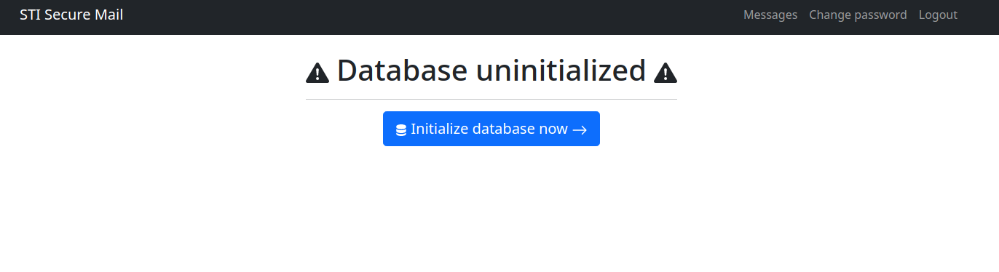
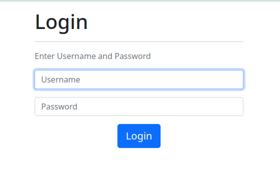
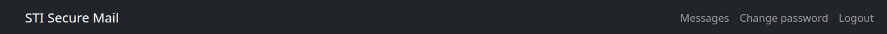
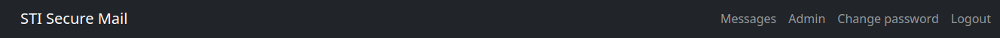
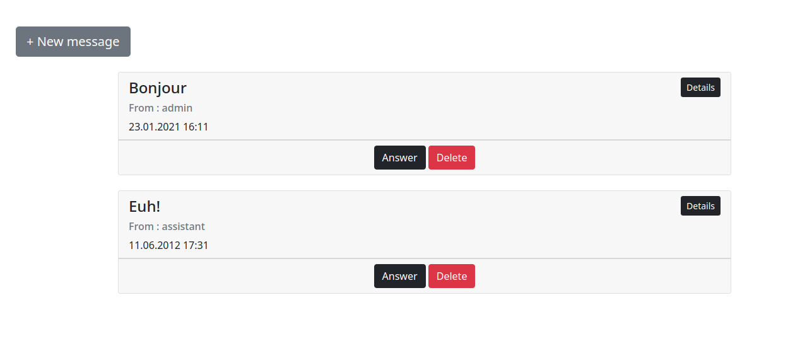
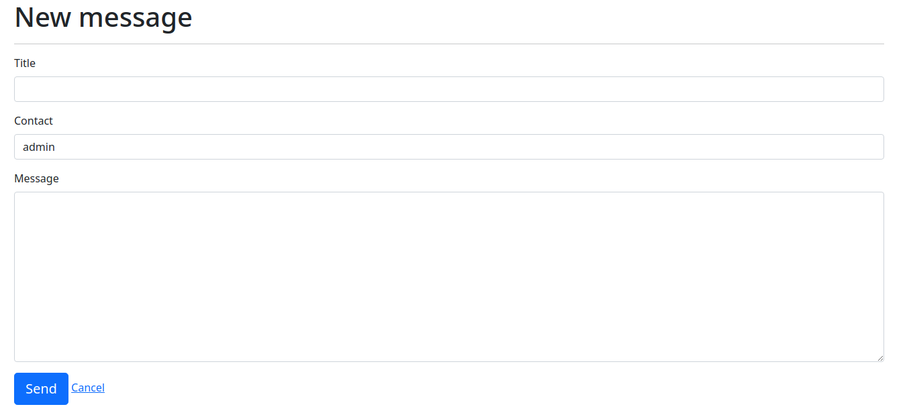
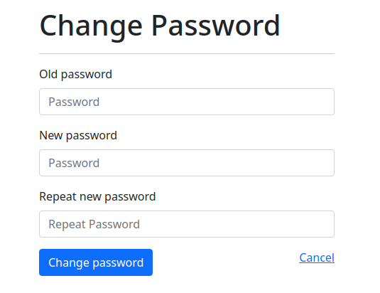
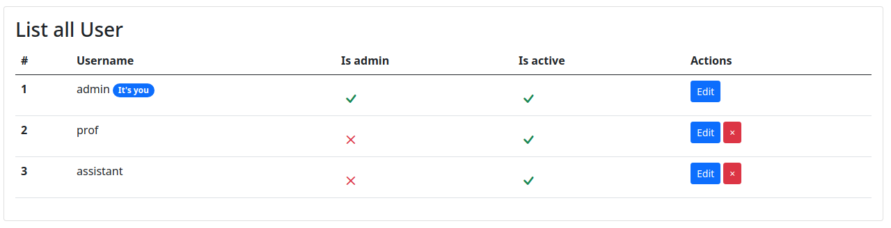
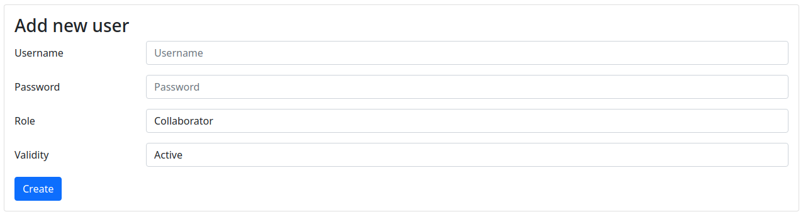
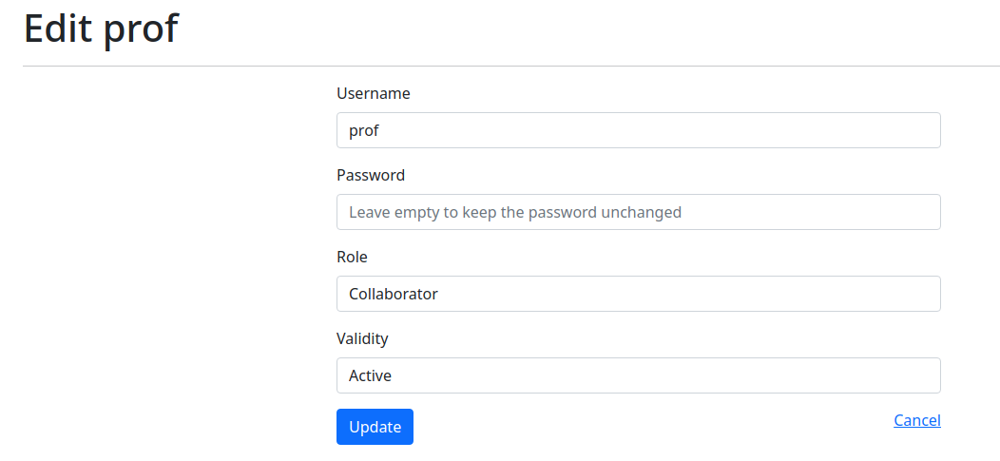

## Guide d'utilisation

**Auteurs:** Balsiger Gil, Barros Henriques Chris

### Lancement de l'application. 
1. Pour commencer, exécuter le script run.sh. ce dernier va lancer le container docker et initialiser la base de données. 
2. Ouvrir un navigateur et allez sur la page http://localhost:8080/login.php

> Utilisateurs existants:
> - admin:admin 
> - prof:prof
> - assistant:assistant

### Page d'initialisation de la base de données

En lançant le Docker, on arrive sur cette page d'initialisation de la base de données:

### Page de login

En lançant le Docker, on arrive sur cette page de login:

On ne peut accéder à aucune fonctionnalité tant que l'on n'est pas connecté. Si on entre des identifiants erronés, il va s'en dire que la connexion est refusée.

Lorsque la connexion est faite, on arrive sur la page des messages, i.e. la boîte de réception. Si un utlisateur est un simple collaborateur, la barre de navigation du haut change et lui donne accès aux pages "Change password" et à un bouton de déconnexion.

Si celui-ci a le rôle d'admin, il obtient l'accès à la page "Admin".

### Onglet Message

Lorsque l'on clique sur l'onglet Message, on arrive sur cette page où la ligne de tous les messages reçus par ordre décroissant. Chaque message a respectivement un titre, l'expéditeur ainsi que la date de réception. On a aussi trois boutons associés dont le rôle va être expliqué.

On voit finalement qu'il est possible de simplement cliquer sur "New Message" afin d'envoyer un nouveau message.

#### Bouton "Details"

Ce bouton sert simplement à afficher le corps du message reçu. En recliquant une nouvelle fois dessus, on recache ce contenu.

#### Bouton "Delete"

Ce bouton sert à supprimer le message de notre boîte de réception. Un message supprimé ne peut plus être retrouvé (alors attention!).

#### Bouton "New Message"

On arrive sur cette page qui permet simplement d'envoyer un message. Afin d'envoyer un message, il faut au moins renseigner le titre ainsi que le contact à qui l'envoyer. Il est donc possible d'envoyer un message vide.

Il n'est pas possible d'envoyer un message qu'aux utilisateurs inscrits dans la liste déroulante.

 

#### Bouton "Answer"

Ce bouton permet de se diriger vers la page de rédaction d'un message mais 

avec les champs de titre et de destinataire déjà renseignés afin de directement répondre à l'utilisateur qui nous a écrit. 

### Onglet "Change password"

Cette page sert simplement à modifier notre mot de passe utilisateur. Il est demandé d'entrer aussi bien l'ancien mot de passe que le nouveau en le répétant.

Si on entre deux mots de passe différents, un message d'erreur apparaît.

### Onglet "Admin"
Cette partie n'est accessible que si un utilisateur a le rôle d'admin. Lorsque l'on arrive sur la page, on a différentes section:

La liste de tous les utilisateurs présents dans la base de données. C'est par ce biais qu'on peut vérifier qu'une insertion ou suppression d'un utilisateur a bien été exécutée. 

Le champ "Actions" sont les actions possiblement réalisables sur les différents utilisateurs:

- Edit: Permet de modifier les informations de dit utilisateur. Ce bouton redirige vers la page d'édition d'un utilisateur (voir plus bas)
- Suppresson: Permet de supprimer l'utilisateur

Afin de créer un nouvel utilisateur sur le site, l'administrateur peut utiliser le formulaire suivant:

### Page d'édition d'un utilisateur

Cette page permet à un administrateur de modifier les informations d'un utilisateur.

