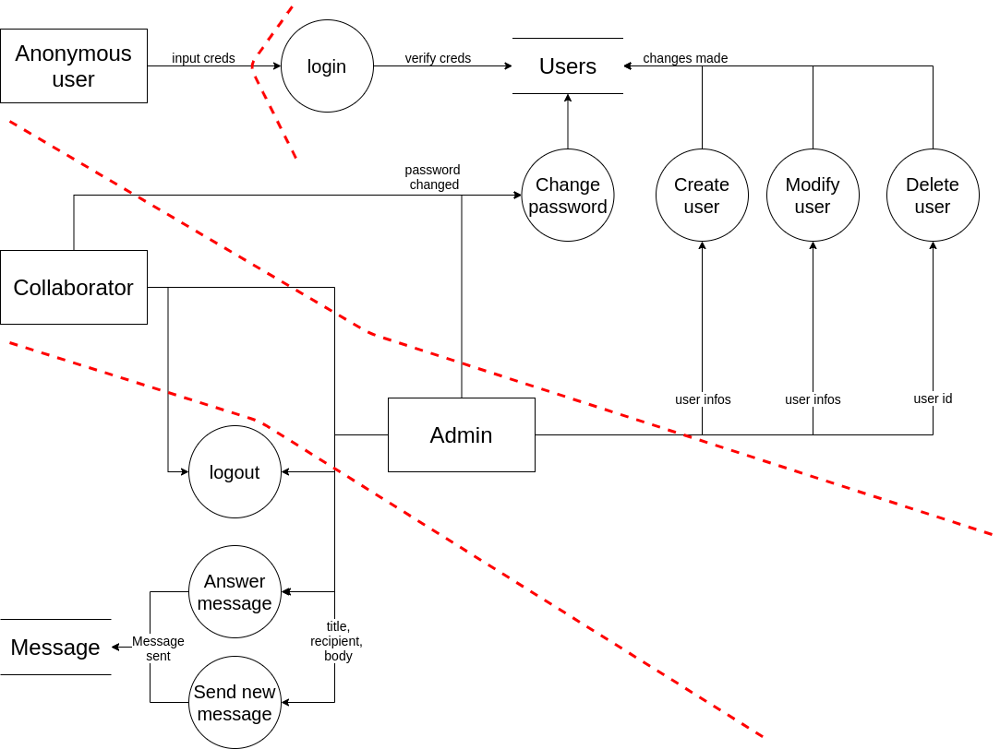

## STI Rapport

**Auteurs:** Balsiger Gil, Barros Henriques Chris 

## Introduction

Le projet vise à trouver des menaces existantes sur le projet 1 et à le modifier de telle sorte que l'application soit sécurisée sans pour autant que cela ne soit au détriment des fonctionnalités déjà mises en place. 

Pour cela, une description du système ainsi qu'une analyse des sources de menace et des vulnérabilités sera faite en la justifiant à l'aide d'un scénario adapté à chacune des vulnérabilités.

## Description du système

### DFD

### Identifier les biens

**Éléments du système:**

- Base de données
  - Table des utilisateurs
  - Table des messages
- Application Web

Chacun représente un service qui communique l'un avec l'autre et ils possèdent un lot de vulnérabilités qui leur est propre. 

**Rôle des utilisateurs:**

- Collaborateur (Écrire des messages, répondre, modification du mot de passe)
- Administrateur (Gestion des utilisateurs et rôles)

### Définition du périmètre de sécurisation

Le but est de sécuriser l'application uniquement. On ne traitera pas les problèmes de vulnérabilité relatifs aux autres services, notamment la base de données (MySQL, SQLite) ou nginx.

## Sources de menace

On peut retrouver deux types de menace:

### Hackers et script-kiddies

**Motivation**

- L'amusement ou la gloire

**Cible**

- Tous les éléments possibles du système

**Potentialité**

- Haute

### Cybercriminels

**Motivation**

- Financières
- Nuire au business d'une entreprise

**Cible**

- Les credentials des clients
- Modification d'informations

**Potentialité**

- Moyenne

### Vulnérabilités possibles

- Injections SQL
- XSS
- CSRF
- Manque de temps
- Manque de connaissance en développement sécurisé
- Contrôle d'accès cassé
- Logiciels pas à jour

## Scénarios d'attaques

### Scenario 1 - Injection

Un utilisateur malveillant parvient à effectuer une injection SQL grâce au formulaire de connexion. Il peut alors obtenir des informations sur le compte administrateur en utilisant les bonnes requêtes SQL. Il peut ensuite se connecter à ce compte et modifier, supprimer les utilisateurs qu'il souhaite. Il pourrait aussi modifier le mot de passe d'un utilisateur pour mettre le mot de passe qu'il veut et pouvoir y accéder à son tour (ou bloquer l'accès du véritable utilisateur).

L'impact sur le business peut être très important car il peut rendre inaccessible tous les comptes existants s'il le souhaite ce qui impliquerait une  perte de crédibilité ainsi que l'impossibilité aux utilisateurs d'utiliser le service.

Les injections demandent de les faire à l'aveugle ou peut-être de faire des injections de second-ordre, ce qui requiert des connaissances, pas à la portée de script-kiddies mais plutôt de cybercriminels du fait que les outils automatiques comme sqlmap ne fonctionne pas (nous avons testé sqlmap, cela n'a pas fonctionné).

**Contre-mesures**

- Validation des inputs utilisateur dans les différents formulaires au niveau du serveur
- Renforcer les contrôles d'accès

### Scenario 2 - XSS

On pourrait envoyer un message contenant du Javascript à l'administrateur à l'intérieur. Ce script pourrait permettre de créer un utilisateur ayant lui aussi les droits admin avec les crendentials voulus. Sinon il est bien entendu possible de simplement nuire à l'expérience utilisateur (faire apparaître des pop-up répétés, supprimer ses messages).

On pourrait imaginer ceci:

On envoie un message à un admin contenant la balise `<script>` et dont la payload effectuerait une requête POST sur la page admin.php et qui créerait un autre utilisateur admin avec les credentials voulus. Comme la cible est un admin, ce dernier a bien les droits de créer un nouvel utilisateur et l'attaque fonctionnerait. 

L'impact sur le business est le même que pour le précédent.

Vu la facilité, toute personne voulant nuire peut effectuer ce genre d'attaque. La difficulté augmentant simplement selon l'importance de la nuisance engendrée, mais une faille XSS reste facilement exploitable.

**Contre-mesures**

- Empêcher l'interprétation des balises `<script>` pour empêcher le lancement de code Javascript en faisant du sanitize sur les inputs utilisateurs.

### Scenario 3 - CSRF

Imaginons qu'un utilisateur malveillant envoie un mail contenant un lien amenant à un site malveillant. Sur ce site, il y aurait un lien avec un texte bidon pour faire cliquer l'utilisateur mais ce lien appelerait en réalité une URL de notre site comme par exemple `http://messenger.ch/delete_account.php`. Comme l'utilisateur est déjà connecté au site, cliquer sur ce lien depuis un autre site aura le même impact et supprimera le compte à l'insu de l'utilisateur.

L'impact sur le business est le même que pour les scénarios précédents.

Ce type d'attaque un peu moins connu que XSS mais assez facile à réaliser puisqu'il suffit juste de faire cliquer l'utilisateur sur un lien depuis un autre site (voir le même site, on pourrait mettre le lien dans un des messages).

**Contre-mesures**

- Mettre en place un système de tokens CSRF avec des hidden input pour chaque formulaire présent dans le site

### Scenario 4 - Bad Access Control

Un attaquant peut modifier le HTML pour que le bouton de suppression d'un message en supprime un qui ne lui apparatient pas, notamment l'id et qui référence le message à supprimer. 

L'impact sur le business est plus minime mais nuit tout de même à l'expérience utilisateur.

Ce type d'attaque est très facile à mettre en place mais n'apporte pas grand chose en terme de données donc seuls les script-kiddies seraient intéressés par ce genre d'attaque.

**Contre-mesures**

- Vérifier que l'utilisateur demandant la suppression du dit message l'ait bel et bien dans sa boîte de réception

### Scénario 5

Des vulnérabilités présentes dans les logiciels utilisés (PHP, NGINX par exemple) pourraient être exploitées si ces derniers ne sont pas à jour. 

L'impact peut être très important car dépendant de failles de sécurité, c'est le système dans son ensemble qui peut tomber.

Les failles peuvent exister indépendamment d'un exploit. Cela peut donc dans certains cas demander beaucoup de connaissances, ce qui n'est à la portée que des hackers très expérimentés

**Contre-mesures**

- Mettre les logiciels à jour

## Conclusion

La plupart des vulnérabilités traitées ici font parties du fameux top 10 d'OWASP. On a constaté que ces erreurs sont très faciles à faire et mettent en danger une application Web mais tout en étant tout aussi facilement remédiables. 

On peut ainsi dire qu'il n'en faut pas beaucoup dans le cycle de développement d'un projet afin que ce dernier soit bien plus sécurisé.

